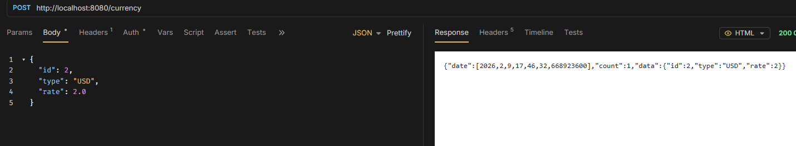

# Post

> `POST /rates` - add new item

```java
@PostMapping
public ApiResponse<CurrencyEntity> createCurrency(
        @RequestHeader("X-Client-Id") String clientId,
        @RequestBody CurrencyEntity currency
) {
    System.out.println("Request from client: " + clientId);

    CurrencyEntity saved = service.createCurrency(currency);
    return new ApiResponse<CurrencyEntity>(saved, 1);
}
```

