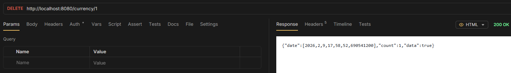

# Delete

> - `DELETE /rates/{id}` - delete item

```java
@DeleteMapping("/{id}")
public ApiResponse<Boolean> deleteCurrency(@PathVariable("id") Long id) {
    return new ApiResponse<Boolean>(service.deleteCurrency(id), 1);
}
```


