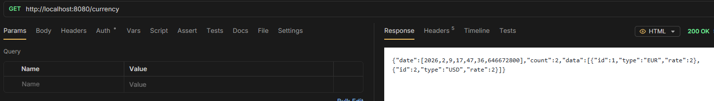

# Get All

> - `GET /rates` (or `/items`) - list all items

```java
@GetMapping
public ApiResponse<List<CurrencyEntity>> getCurrencies(@RequestParam(name = "type", required = false) String type) {
    List<CurrencyEntity> currencyEntities;

    if (type != null) {
        currencyEntities = service.getByType(type);
    } else {
        currencyEntities = service.getAll();
    }
    return new ApiResponse<>(currencyEntities, currencyEntities.size());
}
```


