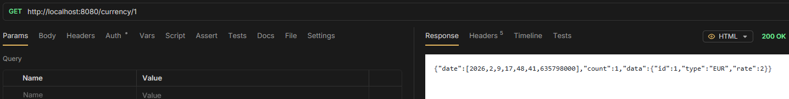

# Get One

> - `GET /rates/{id}` - get item by ID

```java
@GetMapping("/{id}")
public ApiResponse<CurrencyEntity> getCurrencyById(@PathVariable("id") Long id) {
    Optional<CurrencyEntity> entity = service.getCurrencyById(id);
    return entity.map(currencyEntity -> new ApiResponse<>(currencyEntity, 1)).orElseGet(() -> new ApiResponse<>(null, 0));
}
```


