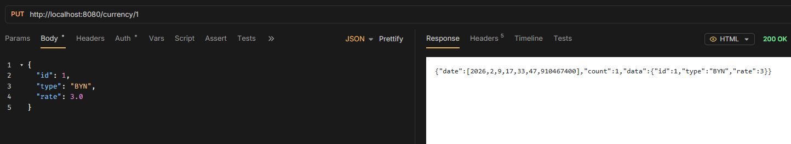

# Put

> - `PUT /rates/{id}` - update existing item

```java
@PutMapping("/{id}")
public ApiResponse<CurrencyEntity> updateCurrency(
        @PathVariable("id") Long id,
        @RequestBody CurrencyEntity currency
) {
    Optional<CurrencyEntity> entity = service.updateCurrency(id, currency);
    return entity.map(currencyEntity -> new ApiResponse<>(currencyEntity, 1)).orElseGet(() -> new ApiResponse<>(null, 0));
}
```


