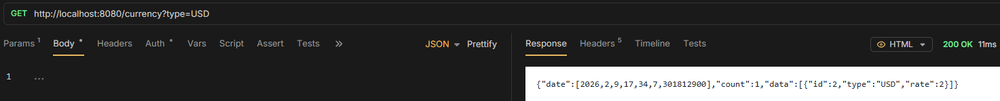

# 7. @RequestParam

Used in requesting all - for type.

```java
@GetMapping
public ApiResponse<List<CurrencyEntity>> getCurrencies(@RequestParam(name = "type", required = false) String type) {
    List<CurrencyEntity> currencyEntities;

    if (type != null) {
        currencyEntities = service.getByType(type);
    } else {
        currencyEntities = service.getAll();
    }
    return new ApiResponse<>(currencyEntities, currencyEntities.size());
}
```


