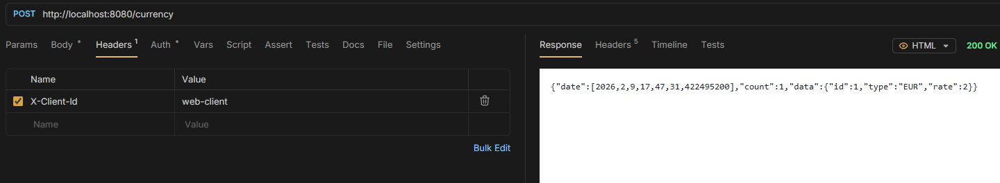
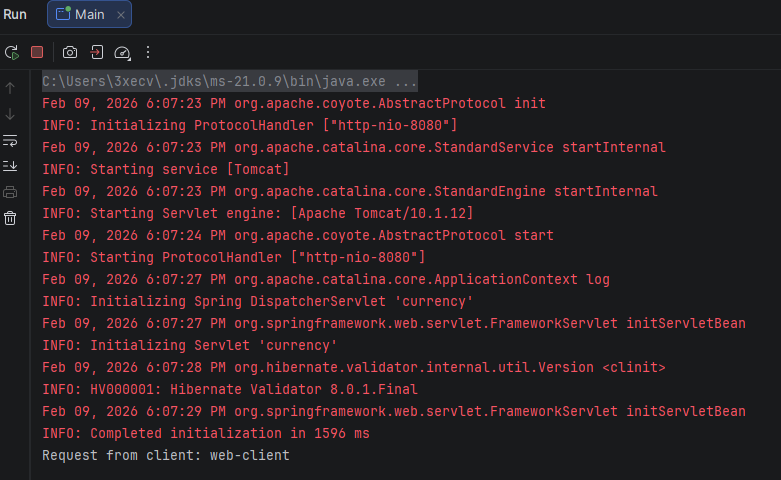

# 8. @RequestHeader

Used in post

```java title="Controller"
@PostMapping
public ApiResponse<CurrencyEntity> createCurrency(
        @RequestHeader("X-Client-Id") String clientId,
        @RequestBody CurrencyEntity currency
) {
    System.out.println("Request from client: " + clientId);

    CurrencyEntity saved = service.createCurrency(currency);
    return new ApiResponse<CurrencyEntity>(saved, 1);
}
```

- post header:
  - 
- sout:
  - 