# Endpoints

> All five CRUD endpoints work correctly

- `Step 1`: Get all - 0 counts
  - 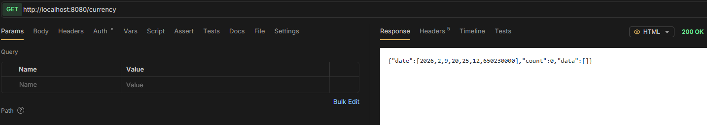
- `Step 2`: Post one entity
  - 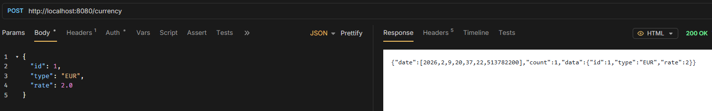
- `Step 3`: Get all - 1 count
  - 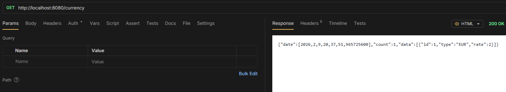
- `Step 4`: Post other entity
  - 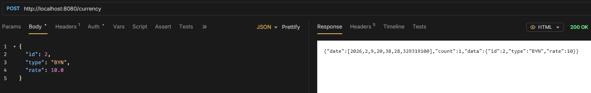
- `Step 5`: Get all - 2 counts
  - 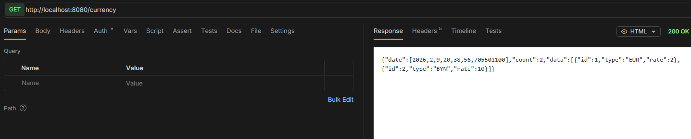
- `Step 6`: Get one of them by id
  - 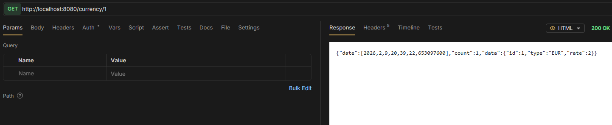
- `Step 7`: Get other by type
  - 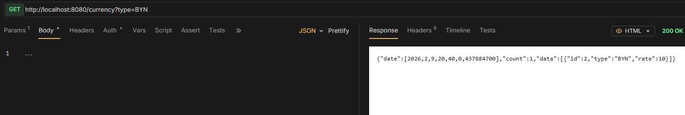
- `Step 8`: Put one of them
  - 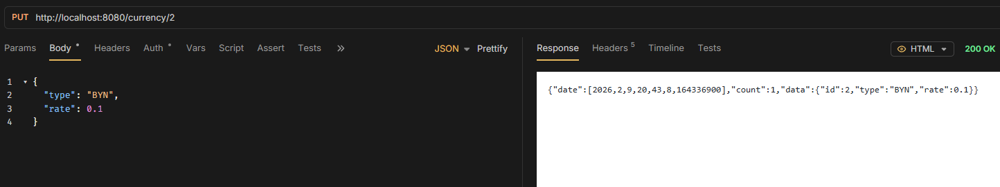
- `Step 9`: Get all
  - 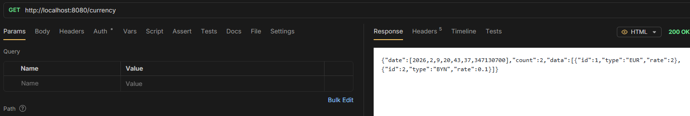
- `Step 10`: Delete one
  - 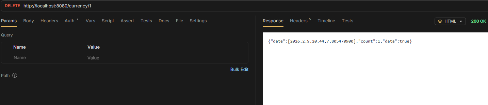
- `Step 11`: Get all
  - 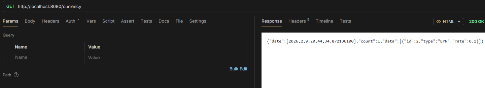

