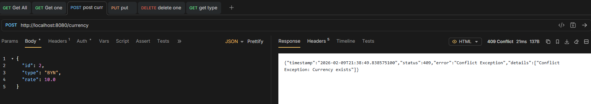

# 409 Error Exist

> 5. Return 409 (Conflict) error when trying to create an already existing item

```java title="Service"
public CurrencyEntity createCurrency(CurrencyDto currency) {
    if (repository.findByType(currency.getType()).isEmpty()) {
        return repository.save(this.entityFromDto(currency));
    } else {
        throw new ConflictException("Currency exists");
    }
}
```

