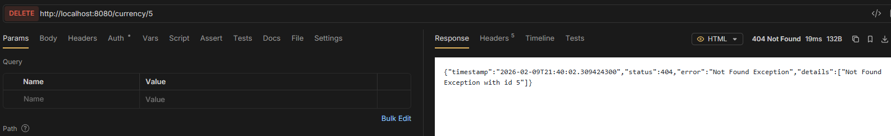

# 404 delete none

> 4. Return 404 error when trying to delete a non-existent item

```java title="Service"
public boolean deleteCurrency(Long id) {
    if (Math.random() < 0.5) {
        throw new RandomException();
    }
    if (repository.findById(id).isPresent()) {
        repository.deleteById(id);
        return true;
    }
    throw new NotFoundException(id, "Currency");
}
```


