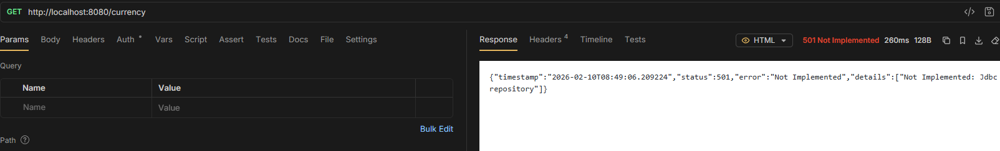
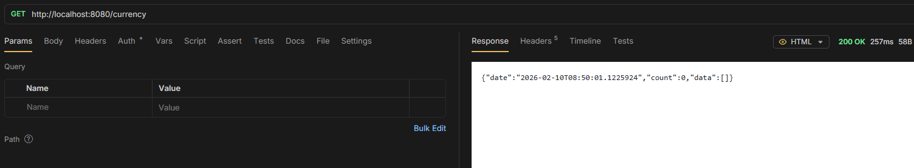
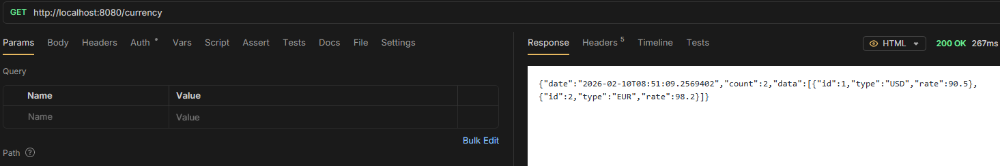

# All existing functionality remains intact after migration

Editing Profiles to `Jdbc`, `Map` and `File`

## JDBC

```txt
server.port=8080
spring.application.name=currency-app

filepath.rates=classpath:rates.txt
spring.profiles.default=file
spring.profiles.active=jdbc
```



## Map

```txt
server.port=8080
spring.application.name=currency-app

filepath.rates=classpath:rates.txt
spring.profiles.default=file
spring.profiles.active=map
```



## File

```txt
server.port=8080
spring.application.name=currency-app

filepath.rates=classpath:rates.txt
spring.profiles.default=file
spring.profiles.active=file
```


