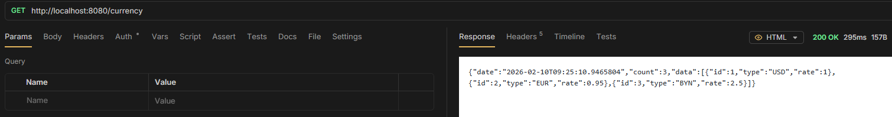
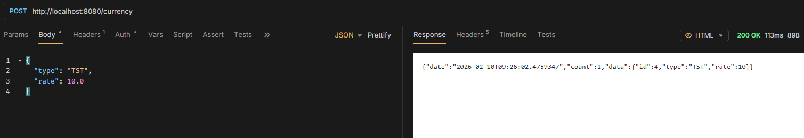
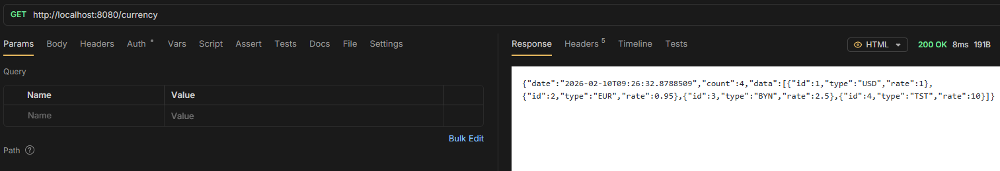
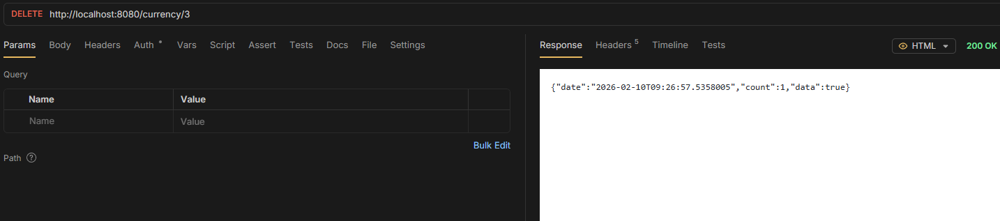
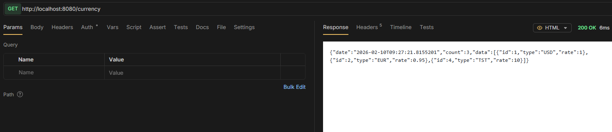
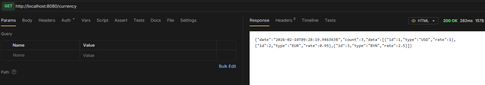
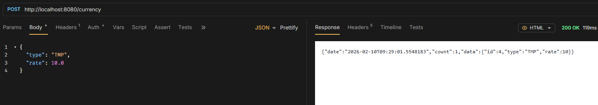
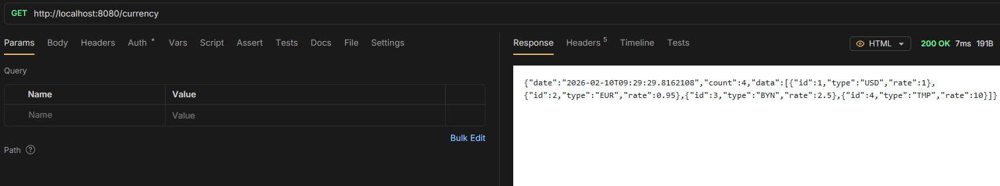
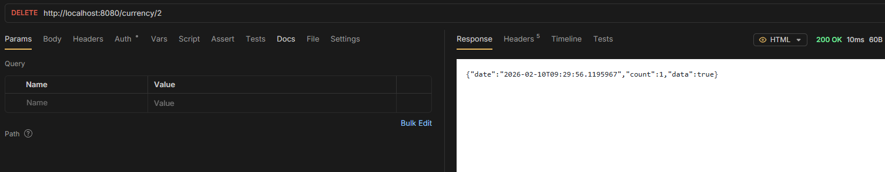
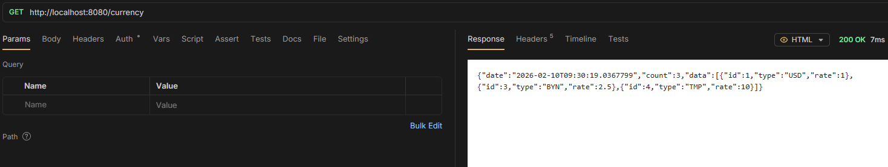

# CRUD operations work correctly with both DAO implementations

simple test:
- 1 get all
- 2 post new
- 3 get all
- 4 delete one
- 5 get all

## JDBC

- 
- 
- 
- 
- 

## Template

- 
- 
- 
- 
- 
