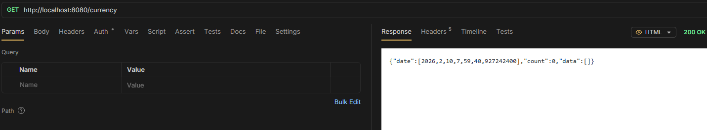
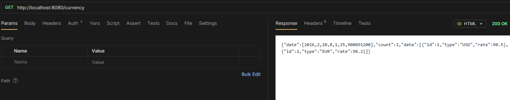
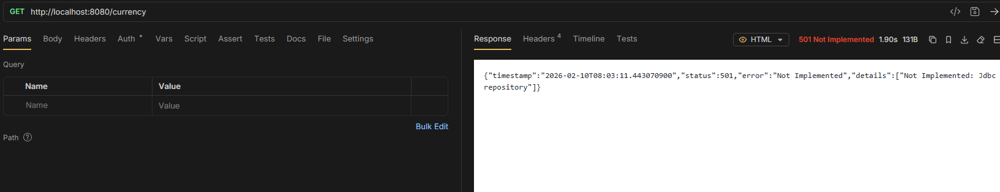

# Correct repository is injected based on configuration

## Using Map

If using map repository -> get all will return 0 counts

```txt title="aplication.properties"
filepath.rates=classpath:rates.txt
repository.type=map
```

Then receives



## Using File

If using file -> get all will return 2 counts, because in file by default we have 2 rows

```txt title="aplication.properties"
filepath.rates=classpath:rates.txt
repository.type=file
```

Then receives



## Using Jdbc

If using jdbc -> get all will return an error, because it is not implemented soon

```txt title="aplication.properties"
filepath.rates=classpath:rates.txt
repository.type=jdbc
```

Then receives


